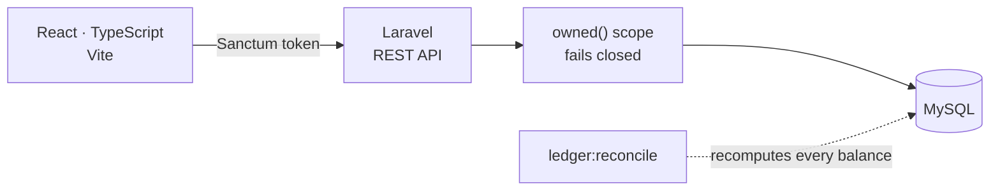
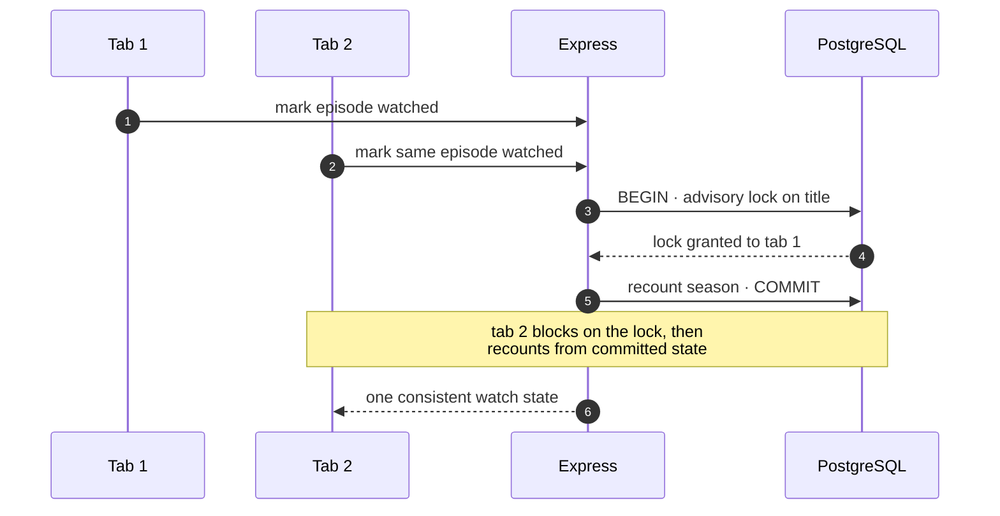

<picture>
  <source media="(prefers-color-scheme: dark)" srcset="assets/banner-dark.svg">
  
</picture>

I build full-stack web applications: React and TypeScript on the front, PHP, Laravel and
Node behind them. Currently at **Devotel**, building React interfaces and custom WordPress
platforms and wiring both up to REST APIs.

I like building things, breaking them, fixing them, and occasionally wondering why I wrote
the code that way in the first place.

---

## [Balancil](https://github.com/alexidrs79/Balancil) — a personal ledger

Accounts, transactions, budgets, savings goals and spending analytics. You enter the
records; it never connects to a bank or moves money. React and TypeScript on the front,
Laravel and Sanctum behind it.

Two decisions I'd defend in a review. Every owned record goes through a query scope that
**fails closed**, so console code has to opt out of the filter deliberately rather than leak
by accident. And a stored balance is never trusted on its own — `ledger:reconcile`
recomputes each one from the transactions behind it, so drift surfaces as a failing command
instead of a quietly wrong number.

`React` · `TypeScript` · `Laravel` · `Sanctum` · `MySQL` · `PHPUnit` · `Vitest`

---

## [Stub](https://github.com/alexidrs79/stub) — a private film and television archive

Track what you've watched, what you're part-way through and what's next, over TMDb's
catalogue. React 19 on the front, Express, Prisma and PostgreSQL behind it.

The interesting problem is concurrency. Marking an episode watched has to update episode
state and recount the season it belongs to, and two open tabs can race that. Both writes run
inside a transaction holding a Postgres advisory lock keyed on the title, so the second one
waits and then recounts from committed state rather than from what it read a moment earlier.

TMDb responses are cached too, so the archive still renders when TMDb is down.

`React 19` · `Express 5` · `Prisma` · `PostgreSQL` · `JWT` · `Vitest`

---

## Also

**[wp-themes](https://github.com/alexidrs79/wp-themes)** — three ACF-driven WordPress themes
built from Figma for client products. One field group and one template part per section, so
the content stays editable in wp-admin rather than hard-coded into the template.

**[portfolio-site](https://github.com/alexidrs79/portfolio-site)** — my own site, React and
Vite, built and deployed to Pages by Actions on every push to `main`. Live at
**[alexidrs79.github.io/portfolio-site](https://alexidrs79.github.io/portfolio-site/)**.

---

## Stack

| | |
| --- | --- |
| **Front end** | React, TypeScript, JavaScript, Next.js, TanStack Query, Redux, Tailwind, Vite |
| **Back end** | PHP, Laravel, Node.js, Express, REST APIs |
| **Data** | PostgreSQL, MySQL, Prisma, SQLite |
| **WordPress** | Custom themes and plugins, ACF, Multisite, WooCommerce, Gutenberg blocks |
| **Testing** | Vitest, PHPUnit, Pest, Testing Library, `node:test` |
| **Ops** | Docker, Nginx, Apache, GitHub Actions |

Every repository runs its own checks on push:

[Portfolio](https://alexidrs79.github.io/portfolio-site/) ·
[LinkedIn](https://www.linkedin.com/in/alexi-dermosesian/) ·
[alexi.drs79@gmail.com](mailto:alexi.drs79@gmail.com)
